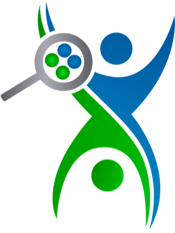
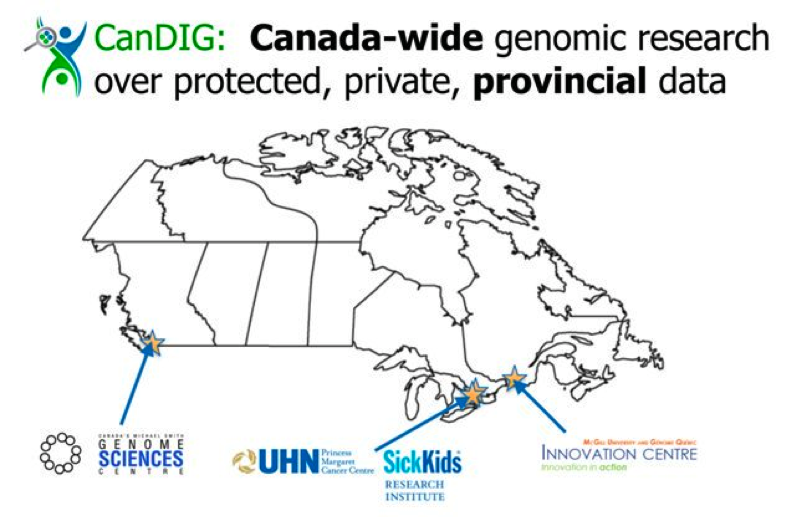
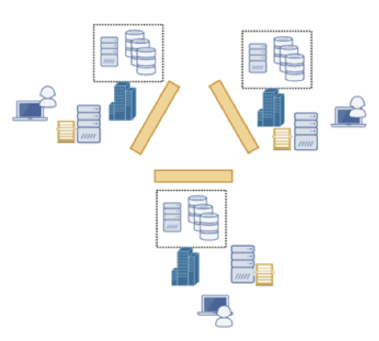
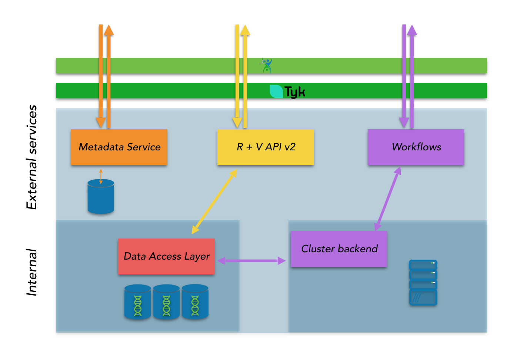
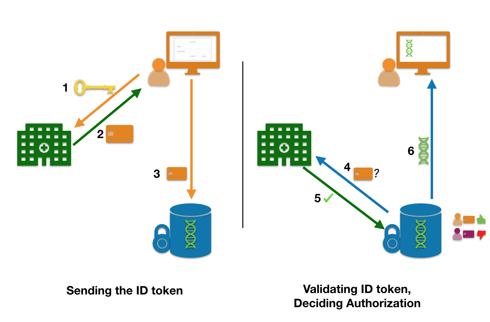
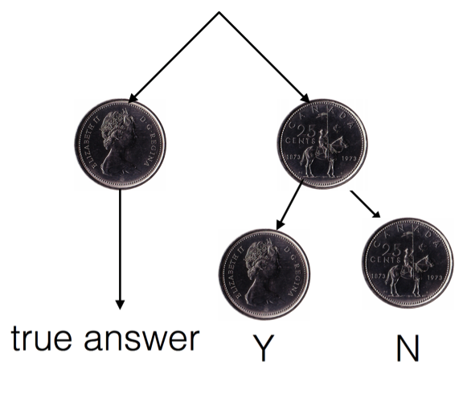
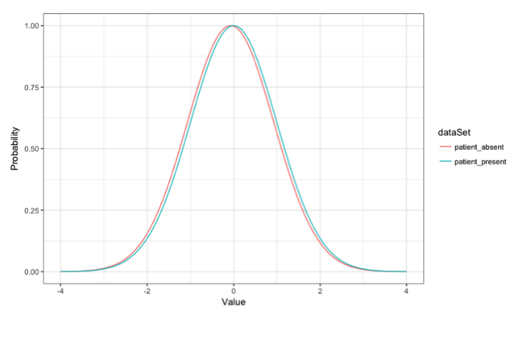
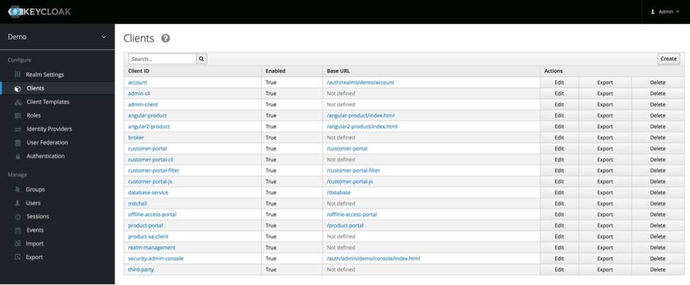
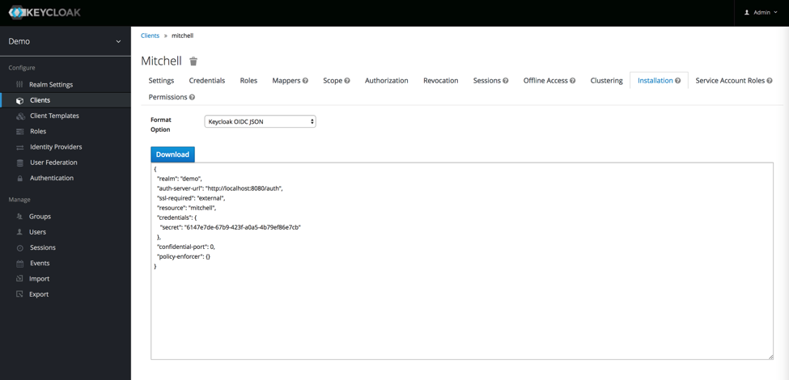

# CanDIG Project Onboarding
## The Canadian Distributed Infrastructure for Genomics

- [CanDIG Project Onboarding](#candig-project-onboarding)
  - [The Canadian Distributed Infrastructure for Genomics](#the-canadian-distributed-infrastructure-for-genomics)
- [Project Communications](#project-communications)
  - [Tools](#tools)
  - [Meetings](#meetings)
- [Project Background](#project-background)
  - [CanDIG Project Overview](#candig-project-overview)
    - [What Success Looks Like](#what-success-looks-like)
    - [Technical Principles](#technical-principles)
  - [The CanDIG Ecosystem](#the-candig-ecosystem)
    - [Entities Involved In CanDIG](#entities-involved-in-candig)
    - [External Partners and Other Projects](#external-partners-and-other-projects)
      - [GA4GH](#ga4gh)
      - [CHORD](#chord)
      - [CINECA](#cineca)
      - [GenAP](#genap)
      - [PROFYLE](#profyle)
      - [TF4CN/MoHN](#tf4cnmohn)
  - [CanDIG Status](#candig-status)
- [CanDIG Architecture and Technologies](#candig-architecture-and-technologies)
  - [CanDIG and GA4GH](#candig-and-ga4gh)
  - [CanDIG and GA4GH APIs](#candig-and-ga4gh-apis)
- [Security and Privacy](#security-and-privacy)
  - [Security](#security)
    - [Threat and Trust Models](#threat-and-trust-models)
    - [Security-sensitive code](#security-sensitive-code)
  - [Authentication and Authorization](#authentication-and-authorization)
  - [Privacy and Queries](#privacy-and-queries)
    - [Randomized Response](#randomized-response)
  - [Differential Privacy on Unbounded Data Sets](#differential-privacy-on-unbounded-data-sets)
- [Appendix A -- List of Useful Acronyms](#appendix-a----list-of-useful-acronyms)
- [Appendix B -- CanDIG Project Technology Stack](#appendix-b----candig-project-technology-stack)
- [Appendix C -- Useful Resources](#appendix-c----useful-resources)
- [Appendix D -- Keycloak](#appendix-d----keycloak)
- [Appendix E -- Technical and Data details](#appendix-e----technical-and-data-details)
  - [Basic common details](#basic-common-details)
  - [CanDIG Version 1 (V1)](#candig-version-1-v1)
  - [User authentication, authorization and data sensitivity](#user-authentication-authorization-and-data-sensitivity)
  - [Features before March 2020](#features-before-march-2020)
  - [CanDIG Version 2 (V2)](#candig-version-2-v2)

# Project Communications

## Tools

Make sure you have access to the following

  Name | Access
  -----|--------
  CanDIG GitHub | <https://github.com/CanDIG>
  CanDIG Slack  | <https://candig.slack.com/>
  CanDIG Google Group | <https://groups.google.com/forum/#!forum/candig>
  CanDIG Google Calendar | <https://calendar.google.com/calendar?cid=YzA3dm9jMGppOTk5cmdoZDlyam9waGtvaDBAZ3JvdXAuY2FsZW5kYXIuZ29vZ2xlLmNvbQ>
  Zoom for video conferencing | <https://www.zoom.us> (used less often now, in place of Slack group video chats)

**Table 1: Team Communication Methods**

And make sure to add yourself and a square head shot so we can add you to the [team page](https://www.distributedgenomics.ca/team.html)!

## Meetings

There is a bi-weekly meeting for the CanDIG project on Thursdays at 2:00pm EST.

You can connect to the meeting via Slack, in the #general channel.  We also
sometimes use [Zoom](http://zoom.us) when communicating with external groups, as
it offers phone-in options. 

Meeting notes can be found at https://github.com/CanDIG/ProjectDocuments/tree/master/Meeting_Notes/Technical_team .

# Project Background

## CanDIG Project Overview

We want researchers to be able to analyze Canada-scale genomic data
sets for health research, but human health data is correctly held to
extremely high privacy standards, with regulations that vary between
provinces: and data stewards have a duty to protect their patients' data.

The CanDIG project is building a federated solution for analysis of
privacy-sensitive, distributed human genomics data sets.  Sites maintain
control over their data while permitting small queries to them, or analysis
pipelines to be run on them.  CanDIG works with the international
standards-setting organization [GA4GH](http://ga4gh.org) 
to make sure that we are as interoperable as possible with other
large-scale genomics and health projects, and that we are following 
the rapidly evolving best standards in health genomics, both technically
and for policies.

CanDIG is currently supporting two national-scale clinical research
projects that had been started before CanDIG:

* [PROFYLE](http://www.terryfox.org/recent-posts/profyle/), a pediatric oncology project, and
* [TF4CN](http://www.bccancer.bc.ca/about/news-stories/news/2016/the-terry-fox-research-institute-princess-margaret-cancer-centre-and-bc-cancer-agency-launch-innovative-pilot-project-to-a), a pilot project for national cancer care

These projects already have established data-access policies,
and the data access use cases are less about analysis and more about
examining a particular patient's data (or discovering similar patients).
But as we grow, we intend to support a wider range of projects and
data sets, and provide new projects with a framework of data access
policies.  Our aim is to both support and drive more widespread 
availability of heath data for analysis in a responsible way.

We are becoming involved with:
* The [Marathon of Hope Network (MoHN)](https://www.marathonofhopecancercentres.ca/launch), a new project for which the TF4CN was a pilot (MoHN is funded 50% by TF and 50% by Canadian Government), and
* The [Digital Health and Discovery Platform (DHDP)](https://www.canada.ca/en/innovation-science-economic-development/news/2019/05/minister-bains-announces-investment-to-accelerate-medical-breakthroughs-that-will-enable-truly-personalized-health-care.html), a project involving health AI company Imagia, MoHN, and other partners; this was announced in late may and at time of writing how we will be involved is still a little unclear.

### What Success Looks Like

For CanDIG the project to be a success,

* Health researchers across Canada will be able to find and request access to a much wider range of data then they had been able to before
* Researchers will be able to combine cohorts and analyses across sites
* New national health genomics projects will be able to get started faster, and get better results more quickly, because of the CanDIG infrastructure, and template documents to get started on privacy, ethics, and consents
* New projects will be more likely to allow data sharing between projects because CanDIG makes it is easy, private, secure, and useful.

Please note that the MoHN will have at least the following sites:
- Quebec
- Ontario
- BC
- Winnipeg
- Halifax (Atlantic region)

Also worth noting is that Winnipeg and Halifax will not have human 
resources to support the technical stack, not even a programmer.
Hence, infrastructure task needs to be done in a way that it is easy to 

- deploy
- monitor/observe
- debug

### Technical Principles

A few technical principles guide the development of the CanDIG software stack:

**Distributed:** All data, and all infrastructure, is completely 
distributed; no shared or centralized services.  All coordination
is done at the level of policy, protocol, or software development

**Local Control:** Consistent with common governance and policy,
local data providers have complete control over access to their
data, and auditability/observability into data access and use.

**API based and driven:** Since we are building a platform whose
success hinges on interaction between users and multiple sites,
new development will rely on API-first design, with APIs developed
and documented, and services and clients built on this.  This
ensures documentation of the APIs, interoperability between clients,
and alignment with GA4GH efforts.

The web development community has extensive experience with
API-driven development, and has converged on the
[12-factor application](https://12factor.net) as the standard
design pattern for building scalable API-driven applications.
CanDIG's software stack will follow this model.

**Secure and Private**:  Our goal is to support privacy-sensitive
(although not directly identifying) human health data, where privacy
and security lapses would be catastrophic for the project.  We will
rely on modern authentication and authorization technologies such
as OpenID Connect so that secure API-based access to data can be achieved,
and will use well-trusted tools wherever at all possible for security-sensitive
code.  When available, we will follow GA4GH Security Working Group's best
practices.  Since CanDIG is also fully distributed there is no central
infrastructure to maintain or secure.  Privacy-preserving methods
such as differential privacy are being actively investigated for
analyses. 

**Open Source, Standards-Based**: Wherever possible, CanDIG builds
on existing standards, on matters both technical (OIDC, REST, 
GraphQL, MySQL, MongoDB, Docker, etc.) and genomic (via its role 
as a driver project for the GA4GH effort).  This approach this 
allows interoperability as wide as possible, while focussing efforts
only where it matters most and not on re-inventing wheels.

**6-month plans, 2-year horizion**: The genomics landscape is
evolving rapidly, from sequencing technologies to standards to
Canadian projects, so very long planning timelines don't make
much sense.  We're adopting a system where we will have 6-month
roadmaps guiding our development, revisited and updated every 3-4
months.  Between those updates, we will begin following standard
agile development approaches, with sprints, backlogs, and regular
updates.

While making project plans more than six months out doesn't make
much sense, the size of our team means that anything we build we
will likely be stuck with for some time, so we aim for anything
we develop to be useful and scalable enough to meet our needs for
the next ~2 years.  What we expect that means is:

* ~10,000 WGS/WES samples per site
    - ~300M-3B unique germline variants
    - ~30B calls
    - ~300,000 clinical/phenotypic metadata entries, totalling ~300MB
    - several hundred PB of raw/aligned sequence data if we keep it
* ~5 sites
* ~100 users/site
* Dozens of projects

We should not invest significant effort in any approach which would 
have trouble scaling to these problem sizes.

**Data types**: We aim to be a data platform for next generation 
genomics and 'omics data -- Whole Genome/Exome Sequencing, 
RNAseq, methylation, and so on -- and the related clinical, 
phenotypic, and process information to make the 'omic data meaningful.
We do _not_ target other medical data types (imaging, cytometry),
and we currently have no plans for microarray-type data.  

We are  also specifically interested in human health data; while the platform
we're building might also be useful for basic biology or model organism
genomic projects (say, mouse genomics), such data does not have the strong
privacy and security requirements of human health, and we do not aim
to support such work.

**Moderate Uptime/Availability Requirements**: CanDIG remains a platform for
research, where uptime requirements are not as stringent as for
mission-critical enterprise applications.  Uptime of 99.5% (roughly
48 hours of downtime/year) would be perfectly acceptable.

### Benefits of CanDIG

To sequencing or other data collecting projects:

* Ease of starting up a national multi-site data project:
* Users can make federated queries and do simple federated analysis through the portals (true of any federation)
* Data remains safe and secure locally (true of any federation)
* Emerging data standards and policies that can be used as a template (provided by the governance of the platform)
* The main genomic sequencing institutions across the country are already signed on (provided by the governance of the platform)
* Ease of operating a national multi-site data project:
    - Single point of contact for authorization
    - “Single pane view” of project data resources across the country (watch the number of sequenced samples rise…)
* No administration of separate user account for researchers (distributed nature of the federation/distributed authentication process)
* No burden of adding users already accessing other projects
* Users can be classified into groups with different access levels, not just local and external users.
* Reassurance of data security:
    - No central infrastructure as a security target (distributed nature of the federation)
    - Strong authentication of users - validated by their institution, credentials automatically revoked if researcher leaves an institution (distributed authentication process)
* Very clear audit logs (API driven approach, distribute authentication/authorization process)
* Differential privacy available for allowing aggregated, privacy-preserving access to data
* Special needs met: Project under active development - feedback into needed features, etc (provided by the governance of the platform)

To researchers:

* Access to more data: More data across the country available
* Discovery tools becoming available for finding data not yet accessible by you but could be requested
* Ease of access
* “Single pane view” of all of the data
* No additional credentials needs - use institutional login
* API driven: not just limited to the portals, will eventually tie into Jupyter, RStudio/Bioconductor

To hosting institutions:

* Very clear authorization and responsibilities model
* Local authorization of data, informed by national services like DAC lists (distributed authentication/authorization process)
* Every request is from an identifiable authorized user (distributed authentication/authorization process)
* Will make use of GA4GH Security Infrastructure policy - clear responsibilities of sites to platform (governance model)
* Easy to revoke access to any project and from any user at any time locally (local authorization)
* Relatively easy to stand up a CanDIG service
* Documented, lightweight services
* Make use of existing authentication, data infrastructure

## The CanDIG Ecosystem

### Entities Involved In CanDIG

The CanDIG project includes Canada's largest genomic data producers.
The figure below shows a map of some of the major players currently
involved in the CanDIG project.

**Figure 1: CanDIG Map**

The below tables show the names and locations of the involved and
collaborating institutions currently associated with the CanDIG project.

  Institution Name                                                                   | Location
  ---------------------------------------------------------------------------------- |-----------------------------
  UHN Princess Margaret Cancer Centre ("UHN" or "PMCC")                              | Toronto, Ontario
  Hospital for Sick Children ("HSC", or "SickKids")                                  | Toronto, Ontario
  McGill University and Genome Québec Innovation Centre  ("MUGQIC" or just "McGill") | Montreal, Québec
  Canada's Michael Smith Genome Sciences Centre ("BCGSC", "GSC")                     | Vancouver, British Columbia
  Jewish General Hospital                                                            | Montreal, Québec
  Université de Sherbrooke                                                           | Sherbrooke, Québec

**Table 2: List of Involved Institutions**

### External Partners and Other Projects

CanDIG the project is involved with several other organziations, groups, grants, or projects.  Here we list some of the key ones:

#### GA4GH

The Global Alliance for Genomics and Health (GA4GH: https://www.ga4gh.org) is an international standards-setting
organization for responsible genomic data sharing for human health which aims to support interoperability.  Setting standards
in such a rapidly moving field means convening projects doing related work so that they can share common problems and best
practices, and build standards (for APIs, data models, and best practices) from there.  [Here](https://youtu.be/n1ybRML9YzQ) is
a short video describing how some current GA4GH standards and APIs fit together.

GA4GH connsists of several _workstreams_:
* **DURI** - Data Use and Research Identity; building common standards for:
    - Interoperable authentication (Researcher ID), focused on standard claims language for OIDC claims; and
    - Computable data use, using such things as the Data Use Ontology
* **Cloud** - The cloud workstream builds tools for "sending the compute to the data":
    - Workflow Execution Service (WES) - an API for sending CWL or WDL (or possibly other) workflows to compute that is local to data
    - Data Object Schema (DOS) - standard lookup tool for translating identifiers to cloud handles
    - Task Registry Service (TRS) - such as dockstore.org, listing tasks or workflows and making the workflow and container images available
* **Genomic Knowledge Standards** (GKS) - Building standard data models and ontologies for (e.g.) variant representation and annotations
* **Large Scale Genomics** (LSG) - a bit of a grab bag, APIs for things like streaming access to data (htsget) and RNA Seq data
* **Clinical/Phenotypic Data Capture** (Clin/Phen) - standard ontologies for use in human health projects, and access to case-level data with Phenopackets
* **Security Working Group** - providing best practices for security implementations, and reviews new standards for possible security issues
* **Regulatory and Ethics Working Group** - providing best practices for privacy, consent, and ethics considerations, and reviews new standards for possible issues

And GA4GH has member _driver projects_ such as CanDIG, which populate the workstreams and other committees: there are many, but
some peer projects we are most likely to interact with include:

* Australian Genomic Health Alliance (AGHA - https://www.australiangenomics.org.au), and
* Genomics England (GEl - https://www.genomicsengland.co.uk) - two national sequencing projects that are tightly integrated into their country's health care systems
* Data Commons, out of University of Chicago (https://ctds.uchicago.edu/gen3/)
* Ontario Institute for Cancer Research (OICR: https://oicr.on.ca), which is involved in GA4GH driver projects such as ICGC Argo

#### CHORD

The CHORD (Canadian Health 'Omics Repository, Distributed) is a 18 month research software engineering contract awarded to
CanDIG starting in Oct 2018 to make the CanDIG software stack robust enough to be able to act as a genomics data repository for
small research labs.  The grant proposal can be read here https://github.com/CanDIG/canarie_rdm_2018 . 

This funds full time individuals at McGill and BCGSC for the entire 18 month duration of the grant, and for 1 year (starting April 2019)
at SickKids.  The CHORD work is fully integrated into the CanDIG roadmap.

#### CINECA

CINECA is a 4-year Canada/EU/African international collaboration building interoperable infrastructure for working on
large-scale and/or longitudinal cohort data, with the aim of being able to perform analyses across cohorts in a federated way.
This starts Jan 2019, and funds 1/2 FTE at each of SickKids and McGill.  The entire work plan can be found on the CanDIG slack, https://candig.slack.com/files/U2BB96B17/FAALHFUVC/cineca-work-plan.pdf .

CanDIG leads Work Package 1, federated queries, and will participate in Work Package 3, interoperable AuthN/AuthZ 
(working through GA4GH DURI), and Work Packages 5&6 focusing on workflow execution.

#### GenAP

GenAP (https://genap.ca/public/home) is a web-based platform for individual researchers or labs to work with their genomic 
data on Compute Canada platforms amongst others, integrating a project dashboard, Galaxy execution, and other services.  
We are investigating various forms of integration, with CanDIG or at least making some CanDIG services available through GenAP.

#### PROFYLE

Precision Oncology for Young People ([PROFYLE](http://www.terryfox.org/recent-posts/profyle/)) 
is a project of the Terry Fox Research Institute (TFRI) and is part 
of the pilot for the CanDIG project.  CanDIG will provide federated access
to metadata (clinical data about the patient) and well as providing access
to project somatic variant data.

#### TF4CN/MoHN

The TF4CN is a pilot project of comprehensive cancer care networks, where a small
number of patients will be very deeply characterized (with whole genome sequencing,
imaging, very deep phenotypic data, _etc_) and that data will be accessible in a
federated way through CanDIG between centres.  TF4CN is also funded by TFRI.  In 2019/2020
the TF4CN will be giving way to the full-fledged [MoHN](https://www.marathonofhopecancercentres.ca/launch)
with significantly increased data volumes.

## CanDIG Status

A number of things are happening in CanDIG right now:

* Technology
	- CanDIG is transitioning from the prototype monolithic Python Flask application to having several smaller services providing similar functionality
    	- Prototype metadata server started
    	- APIs for Metadata and Variants service started
    	- API Gateway (Tyk.io) to be used over Flask, migrate services out
    - Authorization mechanism being developed
* GenAP is mapping out how it could operate with CanDIG services, would need API support on 
	- CanDIG has provided proof of concept of porting pipelines to generate CWL 
* CanDIG is fleshing out it's underlying metadata schema
* Science projects: CanDIG is aiming to support in the near term two national projects:
	- PROFYLE 
	- TF4CN
* Policy and Governance oversight being developed
* CanDIG working with GA4GH

# CanDIG Architecture and Technologies

The CanDIG architecture will be fully distributed, and communication between
the sites will be entirely decentralized peer-to-peer or access to external
services. The figure below represents this distributed model for the project.

**Figure 2: Distributed Model Diagram**

As shown in the above figure there is no centralized infrastructure. The
data queries will be all API based with authentication executed through
OpenID Connect and Keycloak and task execution will be run through the
GA4GH task execution schemas such as Funnel. The sections below will
explain in more detail these implementations.

## CanDIG and GA4GH

The CanDIG project and the GA4GH have overlapping goals; the GA4GH is
attempting to design data-sharing APIs in general, while CanDIG has a
specific project it must implement.  To ensure that all such projects
have a seat at the table, the GA4GH has made 14 projects "Driver Projects"
which participate at the standards-setting process, developing such
things as:

-   RESTful APIs for variants, reads data, metadata
-   Schemas for data exchange
-   Security best practices

The GA4GH efforts are broken up into various workstreams, most of which
have CanDIG representation:

  Work Stream                  | Description | Representative
  -----------------------------|-------------------|------------------------ 
  Discovery                    | Finding data      |  --
  Large-Scale Genomics         | Various           | Jonathan Dursi
  Data Use & Researcher ID     | Authorization & Authentication interop | Zoltan, Richard
  Cloud                        | Cloud execution & data access   | Richard deBorja
  Genomics Knowledge Standards | Variant Annotation etc |  --
  Clinical/Phenotypic          | Metadata standards | Jonathan Dursi
  Regulatory & Ethics          |    Best practices | Richard deBorja
  Security                     |    Best practices | Yann Joly

**Table 3: GA4GH Work Streams**

## CanDIG and GA4GH APIs

All data access for the CanDIG project will be API based, including
local queries. The advantages of choosing this approach are:

-   Abstraction of back-end data stores; we have many sites which may
    store data differently, and if the variants (for instance) are
    stored in the databases, there may be no files to access

-   Fine-grained logging and auditing

-   The potential for fine-grained authorization (does the level of data
    access allowed depend on the amount of data access?)

For interoperability, we will try to use GA4GH APIs where possible,
and to nudge GA4GH APIs in directions we need.

Within each site, there will be several services provided behind a uniform
access layer:

**Figure 4: Internal site structure**

# Security and Privacy

## Security

The overall security of the system can be summarized into the proposed thread model for the project.

### Threat and Trust Models

The **threat model** for the CanDIG project can be summarized into the
following two categories:

The CanDIG project will **not** secure against institutions doing the
following:

-   Falsely allowing someone who is not a CanDIG user to authenticate in as one of their CanDIG users
-   Listening in on all queries it serves, inferring from the queries
    arriving here information about the data at other sites (possible in
    some data mining protocols)
-   Providing significantly false results to rivals

The CanDIG project **will** secure against:

-   Unauthorized access to data through forged requests, man-in-middle
    attacks, listening in
-   Unauthorized access though bugs in servers-authorization, handling
    maliciously-formed requests, etc.
-   Unauthorized access/DOS through malicious images, requests
-   Unnecessary data leakage even to authorized researchers by providing
    too much data though API

_e.g._, our host institutions are not authorized to directly see other
institutions data, but they are otherwise trusted to honestly execute protocols
("semi-honest adversaries"); this is a much simpler model to work in than an 
"Internet of Things" personal health model where every server is potentially compromised.

The **trust relationships** will be formalized in governance documents and
signed inter-institutional agreements.

### Security-sensitive code

Security-sensitive code (such as the OpenID Connect implementations
for Identity Providers and Relying Parties) will be provided by trusted external
implementations, and as little such code as at all possible will be written
in-house.

## Authentication and Authorization

Because of the decentralized nature of CanDIG, with users authenticating
at their "home sites" and requesting data at possibly remote sites, the
distinction between authentication (AuthN) and authorization (AuthZ)
is particularly clear.  Jonathan Dursi can log into his SickKids CanDIG
account and that identity should be recognized at (say) the BCGSC site - 
SickKids has the authority to _authenticate_ Jonathan, to validate his
identity, but it does not have the authority to _authorize_ Jonathan to
access any particular BCGSC data set.  That must be done at BCGSC.

Authentication is performed using OpenID Connect (OIDC) 
which is a layer on top of OAuth 2.0 that uses JSON (optinally) and 
RESTful HTTP API to implement authentication of the identity of users. 
OAuth2 is used in many web apps to _delegate authorization_ - for instance,
you might log in with your google account credentials to allow LinkedIn
to access your Google Contacts.  OpenID Connect adds an identity layer
on top of this - you are now delegating authorization for another application
to see information about your identity.  A researcher or staff member 
uses OpenID Connect at their own institution, the institution issues
a signed certificate authenticating that user as DoctorX@Institution, and
that authentication is used by the data host site to make authorization decisions.

**Figure 5: Using one site as an Identity Provider (IdP), getting an ID token for authentication at another site**

OpenID has ID Providers (IdP), which allow people to log in, and Relying Parties
(RPs), servers which require identity information from an IdP.

We currently use Keycloak (see Appendix D) as an IdP, as it can provide
OIDC services atop of a large number of enterprise identity providers
(LDAP, AD, SAML), and we are using Tyk (https://tyk.io) as an authenticating
reverse proxy which serves as an RP; we are also investigating the ORY
suite of tools (https://www.ory.sh) which includes authorization engines.

## Privacy and Queries

One of the major purposes of the CanDIG project is allow large sets of
data to be queried for analysis while at the same time protecting the
personal and private information of individuals attached to this
information. This can be achieved via two approaches:

-   Returning only the minimal results to queries without additional
    information

-   Adding differential privacy

The below sections talk about two ways of adding differential privacy,
one for binary data responses and one for unbounded data sets.

### Randomized Response

Randomized response is an old method used for surveying participants
where the answer is either illegal or carries a stigma of some sort that
would cause people to answer untruthfully. It is a method of
differential privacy but it only works for binary data (that is, data
that is either one value or another). The easiest way to explain the
method is by illustrating an example scenario. The example is as
follows:

Suppose you are conducting a survey which has the purpose of figuring
out what percent of the population has ever stolen something from a
store. Since theft is illegal, people would be more inclined to answer
no, even if they had stolen something, in order to protect their
character. When conducting the survey then, you ask participants "Have
you ever stolen something from a store?". Following the question and
before the participant answers, you ask them to flip a coin and not
reveal to you the result of the flip. You tell the participant, should
you flip tails then answer "Yes" regardless of the truth (Note this
should always be the answer that carries the stigma). Should they flip
heads, they should answer truthfully. This means that no matter what,
statistically at least half of the answers should be "Yes". Since there
is no way to tell whether the participant flipped heads or tails they
will answer truthfully without worry of the stigma. In this case the
participant's identity is protected. The percent of people who said "No"
then, should be doubled, to indicate the true percent of people that
would have said "No", should they have answered truthfully (This assumes
that the distribution is uniform). For example, if the results of the
survey said 80% of people had stolen something from a store and 20% had
not, then really it is 40% of people had not stolen anything and 60% of
them had. The figure below provides a visual representation of this
example.

Figure 8: Randomized Response Survey Method Using a Coin

This is the first method that could be used to protect individual's data
while still maintaining accurate distributions and results.

## Differential Privacy on Unbounded Data Sets

The second method is for unbounded sets. This essentially meaning that
it is used for data sets that do not have to be either one thing or the
other, but rather could be different by some finite degree of variance.
For this method, again the distribution is looked at as a whole. The
idea behind this method is to add noise to the distribution by
preforming some sort of mathematical transformation on it (there are
multiple mathematical approaches and various reasons for their
selection). The purpose of this mathematical transform is that it will
abstract away some of the sensitivity from the distribution, meaning
that if a single record was removed from the set, regardless of which
one, the change in the distribution should be significantly minimal,
thereby protecting each individual record from being identified. The
figure presented below shows the data distribution results, before and
after the removing of one random record from a data set. The figure
shows a minimal shift but the shape of the distribution remains almost
identical.

Figure 9: Example Variance in Distribution after Differential Privacy by the Addition of Noise

# Appendix A -- List of Useful Acronyms

**Table 4: List of Acronyms**

  Acronym       |Meaning
  ------------- |-------------------------------------------------------
  AAI           |Authentication and Authorization Infrastructure
  Beacon        |“Beacons” provide discovery services for genomic data in ELIXIR and the Beacon network, using the Beacon technology developed for the Global Alliance for Genomics and Health (GA4GH). https://beacon-network.org/; http://beacon-project.io/
  C3G           |Canadian Centre for Computational Genomics
  CAF           |Canadian Access Federation https://www.canarie.ca/identity/caf/ CANARIE’s Canadian Access Federation (CAF) is the umbrella organization for two identity and access management services: eduroam and Federated Identity Management (FIM).
  CANARIE       |https://www.canarie.ca/
  CanDIG        |Canadian Distributed Infrastructure for Genomics
  CCM           |Centre for Computational Medicine at SickKids
  CFI           |Canadian Foundation for Innovation
  CGO		|ClinicaGeno - https://www.clinicageno.com
  CGP           |Centre for Genomic Policy @ McGill - http://www.genomicsandpolicy.org
  CHORD         |https://www.distributedgenomics.ca/releases/candig_chord_genomics_data_management.html
  CINECA        |https://www.cineca-project.eu
  DAC           |Data Access Committee
  DURI          |Data Use and Researcher Identity (GA4GH Working Group)
  GA4GH         |Global Alliance for Genomics and Healthcare
  GENIE         |Genomics Evidence Neoplasia Information Exchange
  GGB           |Genetics and Genome Biology (CCM is under GGB @ SK) http://www.sickkids.ca/Research/Genetics-and-genome-biology/
  GSC / BCGSC   |Canada's Michael Smith Genome Science Centre, BC
  HPC           |High Performance Computing
  HPCS          |High Productivity Computing Systems
  HPC4Health    |High Performance Computing for Healthcare
  HPF           |SickKids’ High Performace (Computing) Facility - https://ccm.sickkids.ca/?page_id=61
  HSC           |Hospital for Sick Children (SickKids)
  HTS           |High Throughput Sequencing
  IOPS          |Input/output Operations per Second
  LDAP          |Lightweight Directory Access Protocol
  MUGQIC        |McGill University and Genome Québec Innovation Centre
  NGS           |Next Generation Sequencing
  OICR          |Ontario Institute for Cancer Research - https://oicr.on.ca
  PMCRT         |Princess Margaret Cancer Research Tower
  PMCC          |Princess Margaret Cancer Centre, part of UHN - https://www.uhn.ca/OurHospitals/PrincessMargaret
  PMH           |Princess Margaret Hospital
  PMGC          |Princess Margaret Genomics Centre
  PROFYLE       |Precision Oncology for Young People - https://www.terryfox.org/media-releases/tfprofyle/
  RIS           |Research Information Systems
  TF4CN/MoHN    |The Terry Fox Canadian Comprehensive Cancer Centres Network (TF4CN), a two-year pilot project that brings together investigators from Vancouver’s BC Cancer and Toronto’s Princess Margaret Cancer Centre, has reached these milestones in just over a year—making researchers hopeful about the potential benefit the network could have on patients across the nation.
  TGH           |Toronto General Hospital
  TWH           |Toronto Women’s Hospital
  UMA           |User Managed Access
  VM            |Virtual Machine
  WES           |Workflow Execution Service
  WGS / WES     |Whole Genome Sequencing, Whole Exome Sequencing

# Appendix B -- CanDIG Project Technology Stack

**Table 5: List of Technologies**

  Technology|   How used
  ----------------|-------
  Docker, Singularity| Containers
  MongoDB, MySQL, SQLite3 | Databases
  OpenID Connect| Authetication
  Keycloak| OIDC Identity Provider
  Tyk.io | API Gateway
  GitHub, Slack, Google Groups| Team communications
  Go| Programming language for new services
  OpenAPI/Swagger | API Definition language, boilerplate code generation
  Python | Prototype Flask application

# Appendix C -- Useful Resources

**Table 6: Getting Started with Genomics resources**

Some resources, in rough order of less to more detailed:

  Resource Title                            | Link to Resource
  ----------------------------------------- |----------------------------------------------------------------------------
  Booklet from Illumina                     | https://www.illumina.com/Documents/products/Illumina_Sequencing_Introduction.pdf
  Aaron Quinlan's Applied Genomics Course   | https://github.com/quinlan-lab/applied-computational-genomics
  Coursera course (there are several other excellent ones) | https://www.coursera.org/lecture/introduction-genomics/next-generation-sequencing-61rlC
  CBW: Bioinformatics on HTS data           |  https://bioinformatics.ca/workshops/2018-informatics-on-high-throughput-sequencing-data/
  CBW: Bioinformatics of Genomic Medicine   | https://bioinformatics.ca/workshops/2018-bioinformatics-of-genomic-medicine/
  CBW: Bioinformatics for Cancer Genomics   | https://bioinformatics.ca/workshops/2018-bioinformatics-for-cancer-genomics/
  Griffith Lab: Precision Medicine Bioinformatics | https://pmbio.org/course
  
# Appendix D -- Keycloak

Keycloak is, amongst other things, an OpenID Connect Identity Provider
which can connect to an institutions existing authentication servers (LDAP, SAML)
and provide an OIDC service on top of this.  Because it is well known, very
flexible, and UHN has a support contract for Keycloak, we are using that as 
our main IdP tool. Admin and account management can be done all on
the Keycloak console pages built into the tool. Authorization is
supported as well as authentication and can be done at either a
role-based or fine-grained level.

Keycloak can be split up into separate "domains", which are called Realms,
that encompass smaller parts of the authentication as a whole. The main 
realm is called master, and any additional realms can be named as per request. Each realm
contains its own set of users and clients. A client can be created
within a realm as a resource that can be accessed via API calls from
external applications. An example list of clients in the "demo" realm is
shown in the below figure.

**Figure 6: Example List of Clients in Demo Realm**

A client will contain a client ID and a client secret that can be used
as parameters into API calls to the realm. This will allow access to the
resource. In order to grant your application access to the client ID,
realm name, and client secret, a JSON file can be generated and
downloaded via the keycloak portal. The path to this is to go to the
correct realm, and then navigate to Clients\>Your
Client\>Installation\>Download. An image of an example JSON file is
shown below. In this example the name of the client is Mitchell, purely
as it was the name of the author of this document.

**Figure 7: Keycloak OIDC JSON**

# Appendix E -- Technical and Data details

## Basic common details
- Current CanDIG platform version is V1 and we are currently working on V2.
- CanDIG platform will host Projects which may be spread across participating Sites.
- Sharing can happen only within a specific project, via the CanDIG platform.
    - For example, you cannot query data for project A and B at the same time.
    - These are two separate projects and if you are participating in both projects you need to ask for those separately.
    - A project example right now is PROFYLE.
- Each project has datasets and each dataset has data types (like variants etc.).

## CanDIG Version 1 (V1)
- V1 is a monolith architecture (for app part). See details in the sections above.
- The follow components are being used at the time of this writing.
    - API gateway - Tyk
    - Auth - Keycloak
    - Main application - Python Flask application
- CanDIG V1 can handle ~3000 patients’ datasets easily (as of August 19, 2019).

## User authentication, authorization and data sensitivity
- On each CanDIG server, there is a separate list of authorized users i.e. users that are allowed to see the data for the project.
- DAC allows or disallows access of an individual for a project.
    - There are two types of DACs — Project DAC and Local DAC.
    - Project DAC is usually distributed among the CanDIG sites. The list of users who are authorized are shared among all of these DAC members.
    - Local DAC is local to a site and project. This is in the future pipeline of CanDIG.
- Each project also has a Leading committee.
- When DAC gives permission to a user to see data, it gives them a number (from here on referred to as `user-number`).
- Each data field in each project also has a number (from here on referred to as `field-number`).
- For a user to be able to see a data field, their user-number has to be greater than or equal to the field-number. This is only the current implementation and may change in the future.
    - Current numbers are from 0 to 4.
    - DACs can decide their own numbers.
    - Numbers can differ from project to project.

## Features before March 2020
According to Zoltan, V1 is almost feature complete, except that CHORD wants to see 
- Discoverable datasets
    - This is also aligned with GA4GH.
    - Given a project, find the type of data and its availability easily.
    - Also, maybe discoverable sites?
- Containerization
    - Being done by Pierre-Olivier at the time of this writing.

## CanDIG Version 2 (V2)
- Will likely be a microservice architecture.
- Microserver artchitecture poses new problems in this form of architecture.
    - e.g. Discovery of the datasets.
    - Metadata associated with a dataset, e.g. reference genome aligned against. This needs to be consistent with the rest of the sites and data types.
