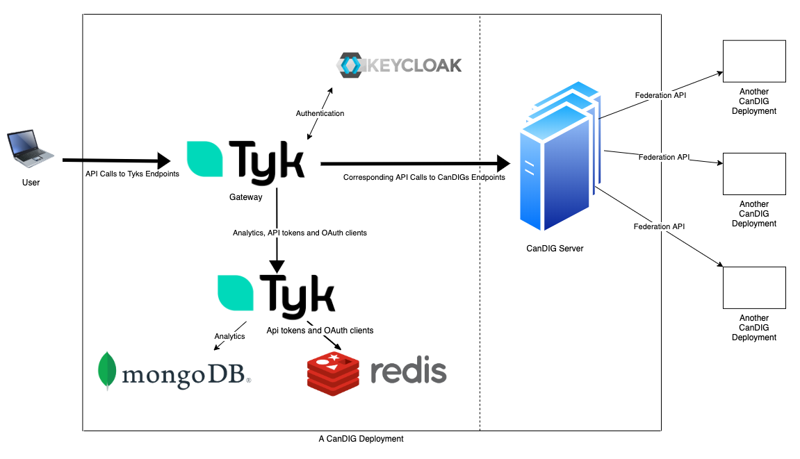

# CanDIG Technical Onboarding
&nbsp;

## CanDIG Platform Overview
The CanDIG Platform has a distributed architecture, meaning each site is meant to run their own local CanDIG deployment and there is no centralized CanDIG server. Users can use their local CanDIG deployment to communicate with other sites. Every site is responsible for handling the authentication of it's users and the authorization of incoming requests from other sites. CanDIG uses an API driven approach, where users send requests to their local CanDIG deployment which communicates to other deployments through the Federation API.

&nbsp;
## Component Overview
&nbsp;
### Tyk Gateway
Tyk Gateway is an API managment platform that CanDIG uses to map API endpoints to endpoints in CanDIG server. When the user makes a request, it is made to Tyk, which forwards the request to the mapped endpoint in CanDIG server.

&nbsp;
### Tyk Pump
Tyk Pump collects metrics on the use of Gateway and has many methods for transmiting these metrics to various databases.

&nbsp;
### Keycloak
An access management server used for authentication and single sign on.

&nbsp;
### CanDIG server
Facilitates the communication between different sites running CanDIG. What else?

&nbsp;
### Mongo
A popular NoSQL database that Tyk uses to store analytics.

&nbsp;
### Redis
A faster in-memory NoSQL database that Tyk uses to store API tokens and OAuth clients.

&nbsp;
## How they interact

Tyk Gateway maps endpoints from Tyk to CanDIG server so that the changing of endpoints is easy and requires no work on the servers side.  
All authentication is done through Keycloak for SSO and security. If authentication is required, gateway redirects to keycloak via a virtual endpoint to a JS script.  
Tyk Pump takes analytics, API tokens and OAuth clients from Gateway and sends it to mongodb and redis to be stored.  

This is what Tyk says mongodb and redis are used for, but is that actually what we are using them for?

&nbsp;

Live Questions: 
1) Anything that has a '?' above
2) How do individual sites communicate, is it as simple as an api call to the other server?
3) Should the dashed line on the diagram be labeled? If so what should it be called?
4) Should we add a section covering Federation API or are its specifics not important enough?
5) Coming soon to a PR near you.